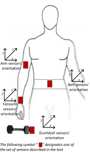

```{r setup, include=FALSE}
knitr::opts_chunk$set(echo = TRUE)
```
---

## Executive Summary

The data for this project comes from a Human Activity Recognition (HAR) dataset.  Six subjects, aged 20 to 28, were asked to perform 10 repetitons of the Unilateral Dumbbell Biceps Curl, with a realtively light weight, in five different ways.  As Vellasco noted in the paper referenced for this dataset, "A key requirement for effective training to have a positive impact on cardio-respiratory fitness is a proper technique. Incorrect technique has been identified as the main cause of training injuries."  Thus, the goal of this analysis is to model and predict the "quality of execution" using accelerometers attached to the subjec's body and dumbbell. 

After cleaning the training dataset by removing the variables that had many missing values and the highly correlated variables, the training dataset was split 70:30 into a subset for training and a subset for validation. Recursive Partitioning and Regression Trees (Rpart), Random Forests (RandomForest), Linear Discriminant Analysis (LDA), k-Nearest Neighbor Classification (knn), Generalized Boosted Regression Models (gbm) and eXtreme Gradient Boosting (xgbTree) were evaulated.  GBM and xgbTree had very long run times despite using parallel processing (doParallel).  Each model was built using the training subset and evaluated the hold out validation set.  Table 1 shows the results for all models.  The most accurate model using random forests (out of sample error of 0.61%) was used to predict the "classe" of 20 observations supplied by Coursera.


## Exploratory Data Analysis
As mentioned above, the goal is to build a model for and predict the "quality of execution".  Each subject performed 10 reps according to the following directions: repetitons in Class A were the correct technique and repetitions in Classes B-E were common improper or incorrect executions of the bicep curl.

* ***Class A:*** exactly according to the specification
* ***Class B:*** throwing the elbows to the front
* ***Class C:*** lifting the dumbbell only halfway
* ***Class D:*** lowering the dumbbell only half way
* ***Class E:*** throwing the hips to the front.

Data was collected using sensors placed as shown in Figure 1 in the Appendix.

The original dataset has 160 fields or columns.  Not all columns are test data. The first column ("X") is a row identifier, an artifact from querying a database.  The next 6 columns identify the user, timestamps and "windows".  There are columns labeled "kurtosis"" and "skewness" that are either blank or have "#DIV/0!" as their value.  Other statistical summary columns ("max", "min", "var", "stddev") and calculated fields ("amplitude") are often valued as "NA".  The very last column in the training set is the "quality of exercise" indicator, "classe".  (Perhaps Italian for class).  The row identifier, user, timestamp, windows and summary statistic and calculated columns were removed with the following code.

```r
names.remove <-c(
  "X", "user_name", "raw_timestamp_part_1", "raw_timestamp_part_2", "cvtd_timestamp", 
  "new_window", "num_window") 

pml.train <- pml.train[,!names(pml.train) %in% names.remove] 
pml.test <- pml.test[,!names(pml.test) %in% names.remove] 

# helper function from Stephen Turner
#http://www.gettinggeneticsdone.com/2011/02/summarize-missing-data-for-all.html
propmiss <- function(dataframe) {
  m <- sapply(dataframe, function(x) {
    data.frame(
      nmiss=sum(is.na(x)), 
      n=length(x), 
      propmiss=sum(is.na(x))/length(x)
    )
  })
  d <- data.frame(t(m))
  d <- sapply(d, unlist)
  d <- as.data.frame(d)
  d$variable <- row.names(d)
  row.names(d) <- NULL
  d <- cbind(d[ncol(d)],d[-ncol(d)])
  return(d[order(d$propmiss), ])
}

#get the fraction missing by variable
names.remove2<-propmiss(pml.train)
c<-names.remove2[which(names.remove2$propmiss > 0.9), 1]
pml.train.clean<-pml.train[,!names(pml.train) %in% names.remove2[which(names.remove2$propmiss > 0.9), 1]] 
pml.test.clean<-pml.test[,!names(pml.test) %in% names.remove2[which(names.remove2$propmiss > 0.9), 1]] 
#recheck
propmiss(pml.train.clean)
propmiss(pml.test.clean)
```
None of the 52 remaining dependent variables had very low variance and all were kept.  However, many machine learning algorithms do not work well with highly correlated independent variables.  These were located with caret's find findCorrelation method.  Thke following highly correlated variables were removed from the training and test datasets: accel_belt_z, roll_belt, accel_belt_y, accel_arm_y, total_accel_belt, accel_dumbbell_z,accel_belt_x, pitch_belt, magnet_dumbbell_x, accel_dumbbell_y, magnet_dumbbell_y, accel_arm_x, accel_dumbbell_x, accel_arm_z, magnet_arm_y, magnet_belt_z, accel_forearm_y, gyros_forearm_y, gyros_dumbbell_x, gyros_dumbbell_z, gyros_arm_x.  This reduces the number of variables in the test and training sets to 31 predictor variables and the "classe" indepedent variable.

```r
#do standard tests for 0 variance
zeroVarCols<-nearZeroVar(pml.train.clean, saveMetrics = TRUE)
pml.train.clean<-pml.train.clean[, zeroVarCols$nzv==FALSE]
pml.test.clean<-pml.test.clean[, zeroVarCols$nzv==FALSE]
#really no changes
dim(pml.train.clean)  #19622 and 53
dim(pml.test.clean) #20 and 53

# find columns to remove in order to reduce pair-wise correlations
highlyCorDescr <- findCorrelation(cor(pml.train.clean[,1:52]), cutoff = .75)
pml.train.clean <- pml.train.clean[,-highlyCorDescr]
pml.test.clean <- pml.test.clean[,-highlyCorDescr]
dim(pml.train.clean);dim(pml.test.clean);
#number of variables is now 32

#cast the classe column as a factor
pml.train.clean$classe = factor(pml.train.clean$classe)

```

## Model Evaluation

To get an unbiased estimation of the out of sample error for each of the tested models, the supplied training dataset was divided (70:30) into a sub training dataset (13,737 records) and a sub validation dataset (5,885 records). The sub training dataset was used to build the model and the sub validation dataset was used to test the model and get an estimate of the classificaton error and accuracy that could be encountered in predicting "classe" values in an external dataset.  Each generated model will be compared on the basis of accuracy, classification error for the validation sub dataset and runtime.  The best model would then be used to predict "classe" for the 20 observations in the external testing dataset.

To speed execution, the doParallel package was used with the number of clusters set to 2.  Using the makeCluster(detectCores()) caused my pesonal computer to freeze.  

## Model Results

In order to estimate the accuracy and the out of sample error, the validation sub dataset was used. The following table of results shows the model, estimated accuracy and estimated out of sample error.   

#### Table 1:  Comparison of in sample and out of sample model results
<table border =1>
<tr><th>Model </th><th>rf</th><th>xgbTree</th><th>gbm</th><th>knn</th><th>lda</th><th>rpart</th></tr>
<tr><td>In training</td><td></td><td></td><td></td><td></td><td></td><td></td></tr>
<tr><td>Accuracy</td><td>1.0000</td><td>0.9993</td><td>0.9609</td><td>0.9239</td><td>0.5836</td><td>0.5316</td></tr>
<tr><td>LL</td><td>0.9997</td><td>0.9988</td><td>0.9575</td><td>0.9194</td><td>0.5753</td><td>0.5232</td></tr>
<tr><td>UL</td><td>1.0000</td><td>0.9997</td><td>0.9641</td><td>0.9283</td><td>0.5919</td><td>0.5400</td></tr>
<tr><td>No Information Rate </td><td>0.2843</td><td>0.2843</td><td>0.2869</td><td>0.2866</td><td>0.2982</td><td>0.3397</td></tr>
<tr><td>P-Value [Acc > NIR]</td><td>&lt; 2.2e-16 </td><td>&lt; 2.2e-16 </td><td>&lt; 2.2e-16 </td><td>&lt; 2.2e-16 </td><td>&lt; 2.2e-16 </td><td>&lt; 2.2e-16</td></tr> 
<tr><td>Kappa</td><td>1.0000</td><td>0.9992</td><td>0.9505</td><td>0.9038</td><td>0.4728</td><td>0.4104</td></tr>
<tr><td>Out of Sample</td><td></td><td></td><td></td><td></td><td></td><td></td></tr>
<tr><td>Accuracy</td><td>0.9939</td><td>0.9901</td><td>0.9446</td><td>0.8669</td><td>0.5799</td><td>0.5179</td></tr>
<tr><td>LL</td><td>0.9915</td><td>0.9873</td><td>0.9385</td><td>0.8580</td><td>0.5672</td><td>0.5051</td></tr>
<tr><td>UL</td><td>0.9957</td><td>0.9925</td><td>0.9503</td><td>0.8755</td><td>0.5926</td><td>0.5308</td></tr>
<tr><td>No Information Rate </td><td>0.2853</td><td>0.2846</td><td>0.2890</td><td>0.2921</td><td>0.2969</td><td>0.3499</td></tr>
<tr><td>P-Value [Acc > NIR]</td><td>&lt; 2.2e-16 </td><td>&lt; 2.2e-16 </td><td>&lt; 2.2e-16 </td><td>&lt; 2.2e-16 </td><td>&lt; 2.2e-16 </td><td>&lt; 2.2e-16</td></tr> 
<tr><td>Kappa</td><td>0.9923</td><td>0.9875</td><td>0.9299</td><td>0.8316</td><td>0.4683</td><td>0.3928</td></tr>
<tr><td>Error</td><td>0.0061</td><td>0.0099</td><td>0.0554</td><td>0.1331</td><td>0.4201</td><td>0.4821</td></tr>
</table>

## External prediction
The most accurate performing model, random forests, was used to predict the value of the "classe" variable in the supplied testing dataset.  These results are shown in the following list.

### Table 2:  Predictons using Random Forest Model

```r
pml.test.predict <- predict(rf.model, pml.test, type="class")
pml.test.predict
```

<table border=1>
<tr><td>&nbsp;1&nbsp;</td><td>&nbsp;2&nbsp;</td><td>&nbsp;3&nbsp;</td><td>&nbsp;4&nbsp;</td><td>&nbsp;5&nbsp;</td><td>&nbsp;6&nbsp;</td><td>&nbsp;7&nbsp;</td><td>&nbsp;8&nbsp;</td><td>&nbsp;9&nbsp;</td><td>&nbsp;10&nbsp;</td><td>&nbsp;11&nbsp;</td><td>&nbsp;12&nbsp;</td><td>&nbsp;13&nbsp;</td><td>&nbsp;14&nbsp;</td><td>&nbsp;15&nbsp;</td><td>&nbsp;16&nbsp;</td><td>&nbsp;17&nbsp;</td><td>&nbsp;18&nbsp;</td><td>&nbsp;19&nbsp;</td><td>&nbsp;20&nbsp;</td></tr>
<tr><td>&nbsp;B&nbsp;</td><td>&nbsp;A&nbsp;</td><td>&nbsp;B&nbsp;</td><td>&nbsp;A&nbsp;</td><td>&nbsp;A&nbsp;</td><td>&nbsp;E&nbsp;</td><td>&nbsp;D&nbsp;</td><td>&nbsp;B&nbsp;</td><td>&nbsp;A&nbsp;</td><td>&nbsp;A&nbsp;</td><td>&nbsp;B&nbsp;</td><td>&nbsp;C&nbsp;</td><td>&nbsp;B&nbsp;</td><td>&nbsp;A&nbsp;</td><td>&nbsp;E&nbsp;</td><td>&nbsp;E&nbsp;</td><td>&nbsp;A&nbsp;</td><td>&nbsp;B&nbsp;</td><td>&nbsp;B&nbsp;</td><td>&nbsp;B&nbsp;</td></tr> 
</table>


## Appendix 
#### Figure 1:  Locations of sensor used in study.  

</br>
This image was downloaded from http://groupware.les.inf.puc-rio.br/har.

## System Information

The analysis was run with the following software and hardware.

```{r}
sessionInfo()
```

The source code for this document and the analysis is stored in GitHub at https://github.com/wer61537/machine_learning.  The R code is at 
https://github.com/wer61537/machine_learning/blob/master/machine_learning.R.  The Markdown document is at https://github.com/wer61537/machine_learning/blob/master/machine_learning.Rmd.


### References
Ugulino, W.; Cardador, D.; Vega, K.; Velloso, E.; Milidiu, R.; Fuks, H. Wearable Computing: Accelerometers' Data Classification of Body Postures and Movements. Proceedings of 21st Brazilian Symposium on Artificial Intelligence. Advances in Artificial Intelligence - SBIA 2012. In: Lecture Notes in Computer Science. , pp. 52-61. Curitiba, PR: Springer Berlin / Heidelberg, 2012. ISBN 978-3-642-34458-9. DOI: 10.1007/978-3-642-34459-6_6. http://groupware.les.inf.puc-rio.br/work.jsf?p1=10335#ixzz4A5kzyJaD

Velloso, E.; Bulling, A.; Gellersen, H.; Ugulino, W.; Fuks, H. Qualitative Activity Recognition of Weight Lifting Exercises. Proceedings of 4th Augmented Human (AH) International Conference in cooperation with ACM SIGCHI (Augmented Human'13) . Stuttgart, Germany: ACM SIGCHI, 2013. http://groupware.les.inf.puc-rio.br/work.jsf?p1=11201#ixzz4A5lFFpw7


